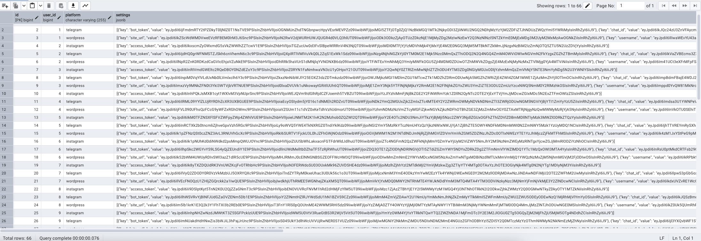
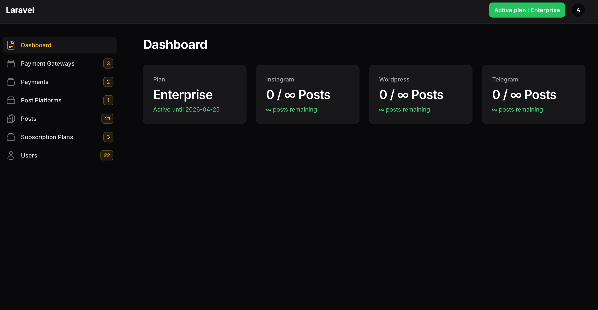

# 📣 Social Broadcaster (Laravel + Livewire + Filament)

  
  
  

A powerful, user-driven content scheduler and multi-platform social media broadcaster built with **Laravel**, **Livewire**, and **Filament**.  
Users can securely connect their social media accounts, purchase subscription plans, and schedule posts to **Instagram**, **WordPress**, and **Telegram** — all from one place.

---

## 🔥 Features

- ✅ User registration with secure authentication
- ✅ Admin-managed:
    - Subscription plans (time & post limits)
    - Payment gateways (Stripe, PayPal, etc.)
    - Supported social platforms (Instagram, Telegram, WordPress)
- ✅ User-specific social account integration
    - Encrypted credentials
    - Only the user can view their credentials
- ✅ Post scheduling with:
    - Platform-specific targeting
    - Delayed and recurring publishing
    - Quota tracking per user plan
- ✅ Background scheduler to process queued posts
- ✅ Status updates and usage logging per post
- ✅ Clean and intuitive dashboards (via Filament)

---

🧰 Tech Stack
- **Framework**: Laravel
- **Frontend Interactivity**: Livewire
- **Admin Panel**: Filament
- **Scheduler / Queues**: Laravel Scheduler + Redis
- **Security**: Laravel Encrypted Storage
- **Publishing APIs**:
    - Instagram Graph API
    - Telegram Bot API
    - WordPress REST API

---

## 🧪 Test Accounts

- **🔐 Admin Panel**
- Email: admin@admin.com
- Password: 1234

- **👤 User Dashboard**
- Email: user@user.com
- Password: 1234

---
## 📸 Visual Walkthrough

### 🔐 Encrypted Social Credentials

### 📊 Admin Panel (Plans & Gateways)

### 🧑‍💼 User Dashboard

---

## 💬 Contributing

Pull requests are welcome. For major changes, please open an issue first to discuss what you'd like to change.
